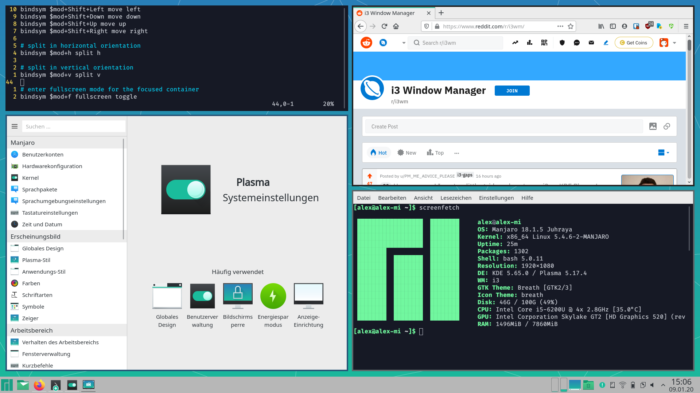
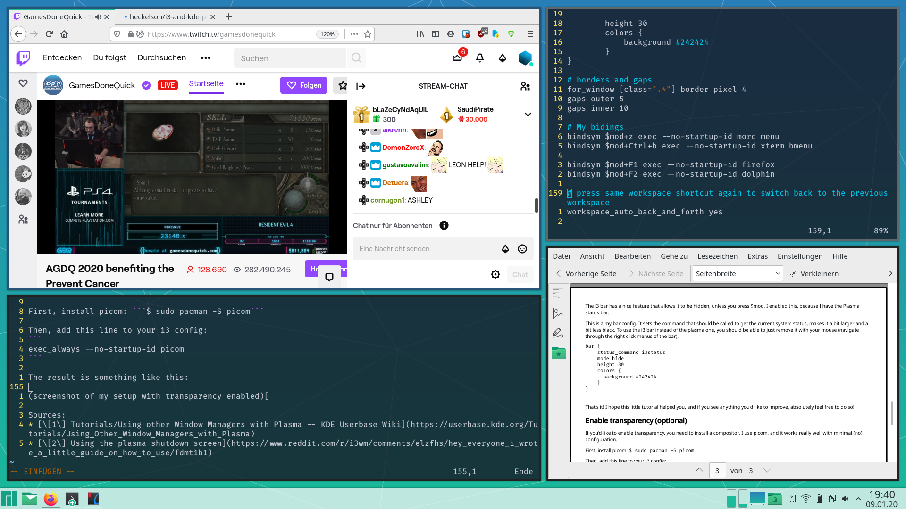

# i3 and KDE Plasma
How to install the i3 window manager on KDE Plasma.

Preview image:



# Situation before the installation
* Manjaro KDE Edition, all updates installed
* KDE Plasma
* KWin

# Installation
## Packages
We're gonna install a couple packages that are required or nice-to-haves on i3. This consists of:

* ```i3-gaps```, obviously
* ```feh``` to set up the background
* ```dmenu``` (not required)
* ```morc_menu``` (not required)
* ```i3status``` for the status bar of i3
* ```wmctrl``` to add to the i3 config (if you're not on an English installation of Plasma)

Here's a oneliner on how I installed everything:
```$ sudo pacman -Syu && sudo pacman -S i3-gaps feh i3-dmenu-desktop morc_menu i3status wmctrl```

# Configuration
## Create a new XSession
Create a new file called plasma-i3.desktop in the `/usr/share/xsessions` directory as su. [1]

Write the following into `/usr/share/xsessions/plasma-i3.desktop`:

```
[Desktop Entry]
Type=XSession
Exec=env KDEWM=/usr/bin/i3 /usr/bin/startplasma-x11
DesktopNames=KDE
Name=Plasma with i3
Comment=Plasma with i3
```

The i3 installation could have installed other .desktop files, you can remove them if you'd like. I only have the default `plasma.dektop` and `plasma-i3.desktop` in my folder.

For the following use your existing i3 config or create a new config using  ```$ i3-config-wizard``` (this also works when you're still in KWin).

Your i3 config should be located at `~/.config/i3/config`, although other locations are possible (depending on your personal configuration).

## Adding stuff to the i3 config
To improve compatibility with Plasma, add the following lines in your i3 config.

```
# Plasma compatibility improvements
for_window [window_role="pop-up"] floating enable
for_window [window_role="task_dialog"] floating enable

for_window [class="yakuake"] floating enable
for_window [class="systemsettings"] floating enable
for_window [class="plasmashell"] floating enable;
for_window [class="Plasma"] floating enable; border none
for_window [title="plasma-desktop"] floating enable; border none
for_window [title="win7"] floating enable; border none
for_window [class="krunner"] floating enable; border none
for_window [class="Kmix"] floating enable; border none
for_window [class="Klipper"] floating enable; border none
for_window [class="Plasmoidviewer"] floating enable; border none
for_window [class="(?i)*nextcloud*"] floating disable
for_window [class="plasmashell" window_type="notification"] border none, move right 700px, move down 450px
no_focus [class="plasmashell" window_type="notification"]
```
## Killing the existing window that covers everything

With my installation, there was a Plasma Desktop window that covered everything and had to be closed with $mod+Shift+q every time I logged in. To circumvent that, follow this tutorial.

<details>
    <summary>English Plasma settings instructions</summary>
    
If you're on an English installation of Plasma, add this line to your i3 config:
```for_window [title="Desktop — Plasma"] kill; floating enable; border none```
</details>


<details>
    <summary>Non-English Plasma settings instructions</summary>
    
If you're not on the English setting, do this instead. This example is using the German Plasma setting.

#### Find out the name of your Plasma desktop
Directly after logging into your i3 environment, switch to a new workspace with $mod+2. Then enter the following in your terminal:

```$ wmctrl -l```

The output should contain the name of the Plasma window. Copy the name into your clipboard.
```
...
0x04400006  0 alex-mi Arbeitsfläche — Plasma
...
```
#### Set it in the i3 config

Using the name from the clipboard as te title, add the following lines to your i3 config:
```
for_window [title="Desktop — Plasma"] kill; floating enable; border none
for_window [title="Arbeitsfläche — Plasma"] kill; floating enable; border none
```
</details>

## Disabling a shortcut that breaks stuff
Launch the Plasma System Settings and go to *Category Workspace > Shortcuts > Category System Services > Plasma* and disable the shortcut "Activities..." that uses the combination ```Meta+Q```.

## Using the plasma shutdown screen
To use the plasma shutdown/logout/reboot screen, delete this line (or comment out)
```
bindsym $mod+Shift+e exec "i3-nagbar " ...
```
and add the following one(s) instead:
### For KDE 4
```
# using plasma's logout screen instead of i3's
bindsym $mod+Shift+e exec --no-startup-id qdbus org.kde.ksmserver /KSMServer org.kde.KSMServerInterface.logout -1 -1 -1
```
### For KDE 5
```
# using plasma's logout screen instead of i3's
bindsym $mod+Shift+e exec --no-startup-id qdbus org.kde.ksmserver /KSMServer org.kde.KSMServerInterface.logout -1 -1 -1
```
*(Note: This seems to not work on some distros.)*
## Setting the Background (optional)

*(Note: This section is outdated. The "Andromeda" packages are no longer in the Manjaro repositories.)*

By default, i3 doesn't set a background and it requires a third party to do that. I am using the default background provided by the Plasma theme with the name of "Andromeda" and a program called `feh` to set the background.

I installed these following packages for the background and theme:

```$ sudo pacman -S andromeda-wallpaper plasma5-themes-andromeda sddm-andromeda-theme andromeda-icon-theme```

and enabled the theming in the Plasma settings.

To set up the same wallpaper in i3, add the following line to the i3 config:

```
exec --no-startup-id feh --bg-scale /usr/share/plasma/look-and-feel/org.manjaro.andromeda.desktop/contents/components/artwork/background.png
```

## Editing the bar (optional)

The i3 bar has a nice feature that allows it to be hidden, unless you press $mod. I enabled this, because I have the Plasma status bar.

This is my bar config. It sets the command that should be called to get the current system status, makes it a bit larger and a bit less black. To use the i3 bar instead of the plasma one, you should be able to just remove it with your mouse (navigate through the right click menus of the bar).

```
bar {
    status_command i3status
    mode hide
    height 30
    colors {
      background #242424
    }
}
```

That's it! I hope this little tutorial helped you, and if you see anything you'd like to improve, absolutely feel free to do so! My issues are open, as are pull requests.

If you'd like to buy me a coffee, follow [this](https://ko-fi.com/heckelson) link.

----

## Enable transparency (optional)

If you'd like to enable transparency, you need to install a compositor. I use picom, and it works really well with minimal (no) configuration.
First, install picom: `$ sudo pacman -S picom`

Then, add this line to your i3 config:
```exec_always --no-startup-id picom -bc```

The result is something like this:



----

### Dual Kawase blur (optional)

This was a bit more tricky to do. Instead of the normal picom from Manjaro's repository, I used a fork called [```picom-tryone-git```](https://aur.archlinux.org/packages/picom-tryone-git/) to replace my existing picom.

To configure picom, I copied `/etc/xdg/picom.conf.example` to `~/.config/picom.conf`. Picom should already pick up this config. There are a couple of things you need to change.

My changes were:

```
...
shadow = true;
shadow-radius = 12;
...
shadow-opacity = 1;
shadow-red = 0.0;
shadow-green = 0.0;
shadow-blue = 0.0;
...
# inactive opacity = 1;
...
frame_opacity = 1;
...
fading = false;
...
backend = "glx";
...
blur:
{
method = "dual_kawase";
size = 25;
deviation = 5.0;
}
```

**Make sure the `blur:` section is on the bottom of the file.**

To start picom in a way that supports kawase blur, replace the line in your i3 config that starts picom with this one:

```exec --no-startup-id picom --backend glx --experimental-backends -bc```

The result can look something like this:


